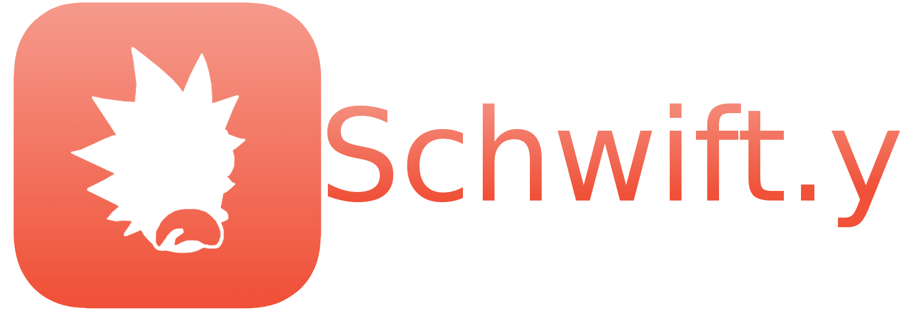

# The Schwift Programming Language



[](https://travis-ci.org/natemara/schwift)

Schwift is an imperative programming language based on the fantastic show, Rick and Morty. It supports all of the classic language features required to elegantly build fantastic programs.

## Variables

Schwift is a dynamically typed language:

```schwift
>>> x squanch 10
>>> show me what you got x
10

>>> x squanch "Hello"
>>> show me what you got x
Hello
```

## Lists

Schwift supports dynamically typed lists as a first-class type:

```schwift
>>> x on a cob
>>> x assimilate 10
>>> x assimilate "hello"
>>> show me what you got x
[Int(10), Str("hello")]
```

## Memory management

Schwift has manual memory management through the flexable `squanch` keyword:

```schwift
>>> x squanch 10
>>> squanch 10
>>> show me what you got x
error: x is undefined
```

# Calling Rust Functions

If you want your schwift programs to be blazingly fast &trade;, you really have
to extend them with Rust functions. Your Rust code should look like this:

## src/lib.rs

```
extern crate schwift;

use schwift::value::Value;
use schwift::error::{SwResult, ErrorKind};

#[no_mangle]
pub fn multiply(args: &[Value]) -> SwResult<Value> {
    if let Value::Int(x) = args[0] {
        if let Value::Int(y) = args[1] {
            return Ok(Value::new(x * y));
        }
    }

    Err(ErrorKind::UnexpectedType("Int, Int".into(), args[0].clone()))
}
```

## Cargo.toml

```
[package]
name = "got_schwifty"
version = "0.1.0"
authors = ["Nate Mara <nathan.mara@kroger.com>"]

[dependencies]
schwift = "*"

[lib]
name = "gotshwifty"
crate-type = ["dylib"]
```

And your schwift should look like this:

## load.y

```
microverse "./path/to/libgotschwifty.so" :<
	multiply()
>:

x squanch multiply(10, 20)

show me what you got x
```

This program should print 200.
